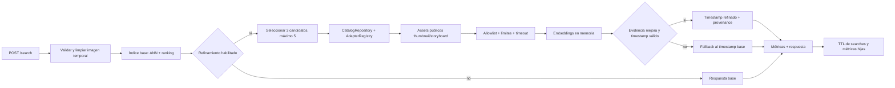

# Refinamiento temporal bajo demanda

## Flujo de una búsqueda

## Fronteras

- `services/api/xtrace_api/search_service.py` conserva la cadena base y no escribe
  índices desde una búsqueda.
- `services/api/xtrace_api/refinement/` contiene la política, catálogo, evaluador,
  materializador de imágenes y mapeo de contratos REST.
- `services/crawler/xtrace_crawler/adapters/` sigue siendo la frontera exclusiva de
  fuente: parser, manifest, allowlist y `VisualAsset`.
- `supabase/migrations/20260818000000_temporal_refinement.sql` contiene únicamente la
  telemetría server-only y sus RLS.
- `src/lib/api/` y `src/features/search/` muestran la procedencia sin cambiar la
  semántica de `match_timestamp_ms`.

## Ciclo de vida de recursos

La petición crea un contexto temporal para la consulta. El refinamiento abre el cliente
del adapter y sus temporales dentro de un `try/finally`; cada imagen se carga, evalúa y
cierra antes de continuar. Al terminar se cierran adapter/HTTP, se borran temporales y
solo queda la respuesta y la telemetría resumida. La cancelación o un timeout sigue la
misma ruta de cleanup.

## Escalado posterior

La implementación inicial es síncrona para cumplir el contrato de `/search`. Si el
catálogo crece y el presupuesto de 10 s deja de ser suficiente, se podrá añadir una
modalidad de job y polling como feature separada; no se cambia silenciosamente este
contrato ni se usa para descargar vídeos completos.
