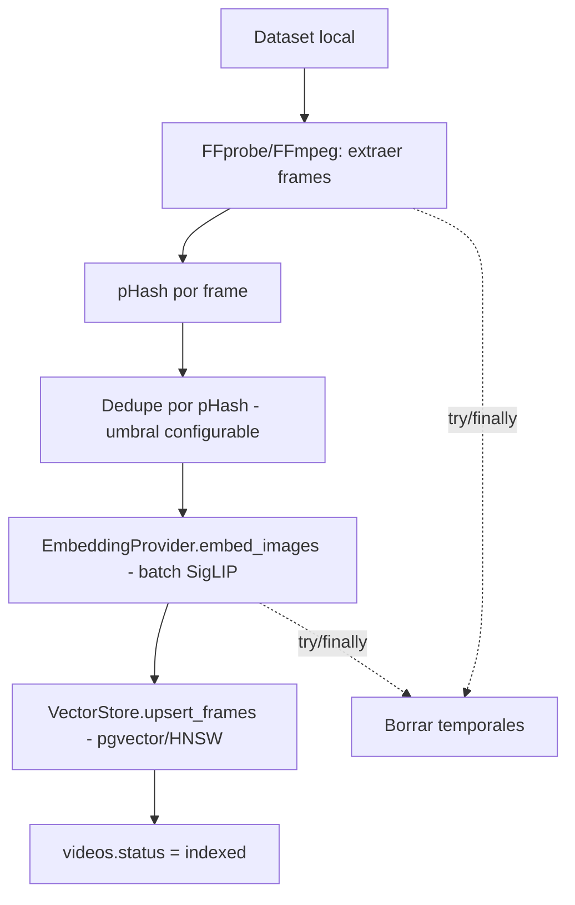
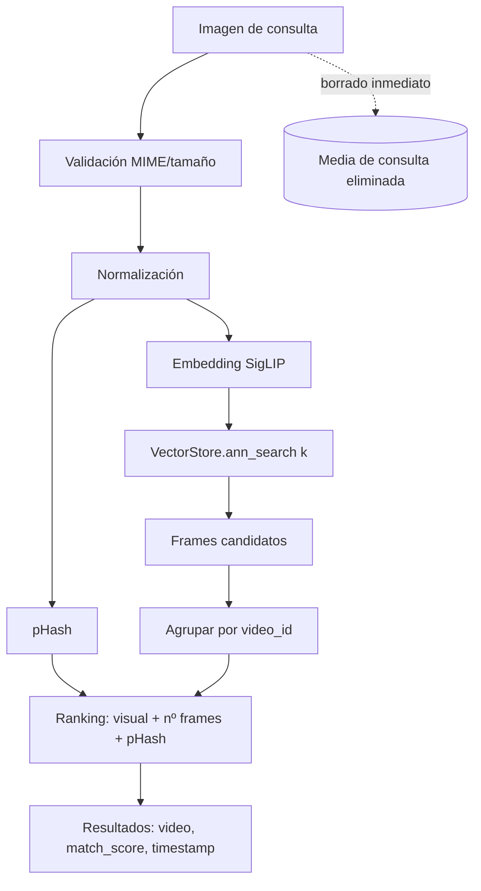
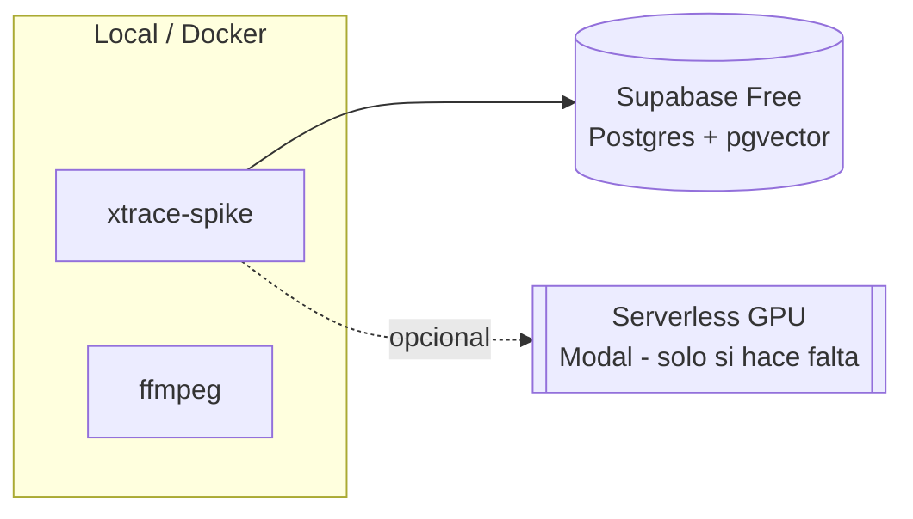

# Arquitectura — XTrace (Visual Search Spike)

> Alcance de este documento: la **Fase 1 (spike de búsqueda visual)**. La arquitectura
> global (crawler, workers, frontend, admin) se ampliará en features posteriores. Ver
> `docs/PRODUCT_IDEA.md` y el prompt maestro para la visión completa.

## System context (spike)

```mermaid
flowchart LR
    Operator([Operador del spike]) -->|CLI| CLI[xtrace-spike CLI]
    CLI --> IDX[Indexing pipeline]
    CLI --> SRCH[Image search]
    CLI --> BENCH[Benchmark runner]
    Dataset[(Dataset local de vídeos)] --> IDX
    IDX --> DB[(Supabase Postgres + pgvector)]
    SRCH --> DB
    BENCH --> SRCH
    subgraph Diferido (post-spike)
      Crawler[Crawler / SourceAdapters]:::deferred
      Web[Frontend Next.js]:::deferred
      API[FastAPI]:::deferred
    end
    classDef deferred stroke-dasharray: 5 5,color:#888;
```

## Indexing flow



## Search flow (imagen)



## Deployment (spike)



## Componentes y abstracciones

| Componente | Responsabilidad | Abstracción |
| --- | --- | --- |
| `ingest/*` | dataset local, frames FFmpeg, dedupe pHash | — |
| `hashing/phash` | firma perceptual near-exact | — |
| `embeddings/*` | vectores visuales por batch | **`EmbeddingProvider`** (ADR-0007) |
| `vectorstore/*` | persistencia + ANN | **`VectorStore`** (ADR-0004/0007) |
| `search/*` | pipeline imagen + ranking | — |
| `benchmark/*` | métricas Top-K/latencia | — |
| `cli.py` | interfaz de validación | Typer (ADR-0008) |

## Security boundaries (spike)

- `service_role` solo en el servicio Python (servidor); nunca en cliente.
- Sin descargas remotas → **sin SSRF** en el spike (dataset local).
- Media de consulta borrada inmediatamente (ADR-0006). Temporales con cleanup `try/finally`.
- RLS deny-by-default en las tablas (verificada con pgTAP).

## Scaling strategy (resumen)

- Spike/MVP: pgvector + HNSW (≤ ~3M vectores según benchmark).
- Futuro (millones/decenas de millones): evaluar Qdrant detrás de `VectorStore` sin tocar
  el dominio. GPU serverless solo cuando haya embeddings pendientes.
