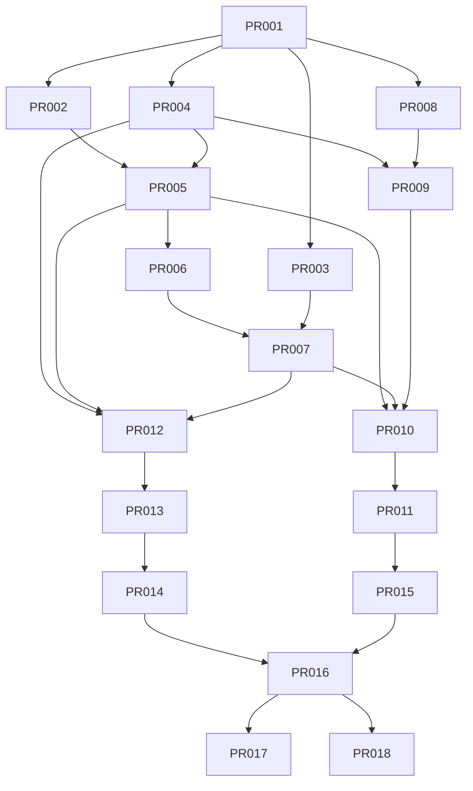

# Tasks: Visual Search Spike (XTrace)

**Input**: `spec.md` (APPROVED), `plan.md`, `data-model.md`, `contracts/`.

**Feature branch base**: `feature/001-visual-search-spike` (cada PR usa su propia rama
hija `feature/001-visual-search-spike/PR-0NN-slug` y termina en un PR aislado).

**Convención de estado por tarea**: `READY` cuando cumple la Definición de Ready
(AGENTS.md §11) y sus dependencias están `DONE`. Solo el orquestador cambia estos estados.

> **Nota para el orquestador (DeepSeek Pro v4)**: asigna una tarea a la vez por
> implementador (DeepSeek v3 Flash). Respeta `allowed_paths` (dos agentes nunca editan los
> mismos archivos). Tras cada tarea: revisión por un agente **distinto** + handoff en
> `docs/handoffs/PR-0NN.md`. No merge a `main` sin aprobación humana y CI verde.

---

## Leyenda

- **Prioridad**: P0 (imprescindible para validar) · P1 (MVP del spike) · P2 (importante).
- **Complejidad**: XS / S / M / L (sin XL; si algo sale XL, dividir).
- **[P]**: paralelizable con otras `[P]` que no compartan `allowed_paths` ni dependencias.

---

## Fase 0 — Setup

### PR-001 · Bootstrap del servicio Python + CI
- **Estado**: DONE (implementado + revisado APPROVED; pendiente de aprobación humana para merge)
- **Prioridad**: P0 · **Complejidad**: S · **Rol**: implementer · **Riesgo**: bajo
- **Spec/Req**: FR-017 · ADR-0003
- **Objetivo**: Crear el esqueleto de `services/search-spike/` (paquete `xtrace_spike`,
  `pyproject.toml`, `ruff`, `mypy`, `pytest`, `Dockerfile`) y un job de CI Python que no
  rompe la pipeline JS.
- **Scope**: scaffolding, config de herramientas, CLI Typer vacía con `--help`, workflow
  GitHub Actions `python-quality` (ruff+mypy+pytest).
- **Dependencias**: —
- **allowed_paths**: `services/search-spike/**`, `.github/workflows/python-quality.yml`,
  `compose.yaml` (añadir servicio spike), `docs/handoffs/PR-001.md`
- **Tests**: `pytest` smoke (import paquete + `--help`); CI verde.
- **Done**: `ruff`, `mypy`, `pytest` pasan; `xtrace-spike --help` funciona.
- **Paralelizable con**: — (base de todo)

---

## Fase 1 — Fundacional (bloqueante)

### PR-002 · [P] `EmbeddingProvider` (ABC) + `FakeEmbeddingProvider`
- **Estado**: DONE (implementado + revisado APPROVED + mergeado a feature)
- **Prioridad**: P0 · **Complejidad**: S · **Rol**: implementer · **Riesgo**: bajo
- **Spec/Req**: FR-005 · ADR-0007 · contracts §3
- **Objetivo**: Interfaz `EmbeddingProvider` (embed_images batch, `dimension`, `model_id`) y
  un `FakeEmbeddingProvider` determinista (hash→vector L2-normalizado, dimensión configurable).
- **Dependencias**: PR-001
- **allowed_paths**: `services/search-spike/xtrace_spike/embeddings/**`,
  `services/search-spike/tests/unit/test_embeddings_fake.py`, `docs/handoffs/PR-002.md`
- **Tests**: determinismo, shape `(N,D)`, normalización L2.
- **Done**: contrato estable + fake testeado.
- **Paralelizable con**: PR-003, PR-004

### PR-003 · [P] `VectorStore` (ABC) + `InMemoryVectorStore`
- **Estado**: DONE (implementado + revisado APPROVED + mergeado a feature)
- **Prioridad**: P0 · **Complejidad**: S · **Rol**: implementer · **Riesgo**: bajo
- **Spec/Req**: FR-006 · ADR-0004/0007 · contracts §2
- **Objetivo**: Interfaz `VectorStore` (`upsert_frames`, `ann_search`, `delete_video`,
  `stats`) + implementación en memoria (coseno) para tests del dominio sin DB.
- **Dependencias**: PR-001
- **allowed_paths**: `services/search-spike/xtrace_spike/vectorstore/base.py`,
  `services/search-spike/xtrace_spike/vectorstore/in_memory.py`,
  `services/search-spike/tests/unit/test_vectorstore_inmemory.py`, `docs/handoffs/PR-003.md`
- **Tests**: orden por distancia, `delete_video`, filtro `exclude_videos`.
- **Done**: contrato + impl memoria testeados.
- **Paralelizable con**: PR-002, PR-004

### PR-004 · [P] Módulo pHash
- **Estado**: DONE (implementado + revisado APPROVED + mergeado a feature)
- **Prioridad**: P0 · **Complejidad**: XS · **Rol**: implementer · **Riesgo**: bajo
- **Spec/Req**: FR-004 · ADR-0005
- **Objetivo**: `hashing/phash.py`: pHash 64-bit desde imagen + distancia de Hamming.
- **Dependencias**: PR-001
- **allowed_paths**: `services/search-spike/xtrace_spike/hashing/**`,
  `services/search-spike/tests/unit/test_phash.py`, `docs/handoffs/PR-004.md`
- **Tests**: estabilidad ante recompresión/resize leve; Hamming coherente.
- **Done**: pHash y distancia testeados.
- **Paralelizable con**: PR-002, PR-003

### PR-005 · `SiglipLocalProvider` + mini-benchmark de modelo/dimensión
- **Estado**: DONE (implementado + revisado APPROVED + mergeado a feature; D=768)
- **Prioridad**: P0 · **Complejidad**: M · **Rol**: implementer · **Riesgo**: medio
- **Spec/Req**: FR-005 · ADR-0005 · plan §Risks (fija `D`)
- **Objetivo**: Implementación real con SigLIP2 (fallback OpenCLIP) tras `EmbeddingProvider`;
  medir precision/recall aproximados, frames/s, VRAM y **fijar la dimensión `D`** que usará
  el esquema. Documentar la elección.
- **Dependencias**: PR-002, PR-004
- **allowed_paths**: `services/search-spike/xtrace_spike/embeddings/siglip_local.py`,
  `services/search-spike/tests/integration/test_siglip_provider.py`,
  `docs/adr/0005-phash-plus-embeddings.md` (anexar dimensión elegida),
  `docs/handoffs/PR-005.md`
- **Tests**: integration marcada `@slow` (opcional en CI); shape/normalización; smoke con
  imágenes fixture.
- **Done**: `D` fijada y documentada; provider real funcional en local.
- **Paralelizable con**: — (produce `D`, precede al esquema)

### PR-006 · Migración DB (pgvector + esquema + índices) + pgTAP
- **Prioridad**: P0 · **Complejidad**: M · **Rol**: data-specialist · **Riesgo**: medio
- **Spec/Req**: FR-006/007/008/018, SC-005 · ADR-0004/0006 · `data-model.md`
- **Objetivo**: Migración Supabase: `create extension vector`; tablas `videos`, `frames`,
  `searches`; constraints únicos (idempotencia); índices **HNSW** (`vector(D)`), `phash`,
  `video_id`; RLS deny-by-default. Tests pgTAP.
- **Dependencias**: PR-005 (necesita `D`)
- **allowed_paths**: `supabase/migrations/*_visual_search_spike.sql`,
  `supabase/tests/visual_search_spike_schema.test.sql`, `docs/handoffs/PR-006.md`
- **Tests**: pgTAP (tablas, uniques, índices, RLS) vía `pnpm test:db`.
- **Done**: `supabase db reset` aplica; pgTAP verde.
- **Paralelizable con**: — (bloquea PgVectorStore)

### PR-007 · `PgVectorStore` (impl `VectorStore` sobre pgvector) + integration
- **Prioridad**: P0 · **Complejidad**: M · **Rol**: implementer · **Riesgo**: medio
- **Spec/Req**: FR-006, SC-003 · ADR-0004
- **Objetivo**: Implementar `VectorStore` con pgvector/HNSW (coseno), upsert idempotente,
  `delete_video`, `stats`, filtro `excluded`.
- **Dependencias**: PR-003, PR-006
- **allowed_paths**: `services/search-spike/xtrace_spike/vectorstore/pgvector.py`,
  `services/search-spike/xtrace_spike/repo.py`,
  `services/search-spike/tests/integration/test_pgvector_store.py`,
  `docs/handoffs/PR-007.md`
- **Tests**: integration contra Supabase local (upsert+ann+delete+stats, idempotencia).
- **Done**: paridad con `InMemoryVectorStore` en el contrato; integration verde.
- **Paralelizable con**: PR-008 (archivos distintos)

---

## Fase 2 — US1: Indexar dataset local (P1) 🎯

### PR-008 · Ingesta: dataset loader + extracción de frames (FFmpeg)
- **Estado**: DONE (implementado + revisado APPROVED + mergeado a feature)
- **Prioridad**: P1 · **Complejidad**: M · **Rol**: implementer · **Riesgo**: medio
- **Spec/Req**: FR-001, FR-002 · ADR-0006
- **Objetivo**: `ingest/dataset.py` (recorrer dataset local, `local_ref` estable) y
  `ingest/frames.py` (FFprobe + FFmpeg: fps/scale configurables) con temporales seguros.
- **Dependencias**: PR-001
- **allowed_paths**: `services/search-spike/xtrace_spike/ingest/dataset.py`,
  `services/search-spike/xtrace_spike/ingest/frames.py`,
  `services/search-spike/tests/unit/test_ingest.py`,
  `services/search-spike/tests/fixtures/**`, `docs/handoffs/PR-008.md`
- **Tests**: extracción sobre fixture pequeño; nº de frames coherente; ficheros corruptos
  → error controlado.
- **Done**: frames extraídos y temporales listados para cleanup.
- **Paralelizable con**: PR-007

### PR-009 · Deduplicación de frames por pHash
- **Estado**: DONE (implementado + revisado APPROVED + mergeado a feature)
- **Prioridad**: P1 · **Complejidad**: S · **Rol**: implementer · **Riesgo**: bajo
- **Spec/Req**: FR-003
- **Objetivo**: `ingest/dedupe.py`: reducir frames casi idénticos con umbral Hamming
  configurable, conservando representativos.
- **Dependencias**: PR-004, PR-008
- **allowed_paths**: `services/search-spike/xtrace_spike/ingest/dedupe.py`,
  `services/search-spike/tests/unit/test_dedupe.py`, `docs/handoffs/PR-009.md`
- **Tests**: dataset con frames idénticos → 1 representativo; umbral respeta variación.
- **Done**: dedupe determinista y configurable.
- **Paralelizable con**: —

### PR-010 · Pipeline de indexación (idempotente + cleanup)
- **Prioridad**: P1 · **Complejidad**: M · **Rol**: implementer · **Riesgo**: medio
- **Spec/Req**: FR-005/006/007/008/009, SC-005/006 · ADR-0006
- **Objetivo**: `indexing/pipeline.py`: ingest→dedupe→embed(batch)→`VectorStore.upsert`,
  gestión de estado del vídeo, **idempotencia** y **cleanup `try/finally`**.
- **Dependencias**: PR-005, PR-007, PR-009
- **allowed_paths**: `services/search-spike/xtrace_spike/indexing/**`,
  `services/search-spike/tests/integration/test_indexing_pipeline.py`,
  `docs/handoffs/PR-010.md`
- **Tests**: integration end-to-end en fixtures; reindexar no duplica (SC-005); sin
  temporales tras fallo (SC-006).
- **Done**: dataset fixture queda `indexed` con frames+vectores.
- **Paralelizable con**: —

### PR-011 · CLI `index` + `stats`
- **Prioridad**: P1 · **Complejidad**: S · **Rol**: implementer · **Riesgo**: bajo
- **Spec/Req**: FR-017, observabilidad · contracts §1
- **Objetivo**: Comandos `index` y `stats` (salida JSON) sobre el pipeline.
- **Dependencias**: PR-010
- **allowed_paths**: `services/search-spike/xtrace_spike/cli.py`,
  `services/search-spike/tests/unit/test_cli_index.py`, `docs/handoffs/PR-011.md`
- **Tests**: CLI index sobre fixture; `stats` reporta totales.
- **Done**: `xtrace-spike index/stats` funcionales con JSON estable.
- **Paralelizable con**: —

---

## Fase 3 — US2: Búsqueda por imagen (P1) 🎯

### PR-012 · Pipeline de búsqueda por imagen
- **Prioridad**: P1 · **Complejidad**: M · **Rol**: implementer · **Riesgo**: medio
- **Spec/Req**: FR-010, FR-012 · contracts §1
- **Objetivo**: `search/image_search.py`: normalizar→pHash→embed→`ann_search`→recuperar
  candidatos→agrupar por `video_id`.
- **Dependencias**: PR-004, PR-005, PR-007
- **allowed_paths**: `services/search-spike/xtrace_spike/search/image_search.py`,
  `services/search-spike/tests/integration/test_image_search.py`, `docs/handoffs/PR-012.md`
- **Tests**: captura exacta de vídeo indexado → aparece; agrupación correcta.
- **Paralelizable con**: —

### PR-013 · Ranking configurable + timestamp + exclusión
- **Prioridad**: P1 · **Complejidad**: M · **Rol**: implementer · **Riesgo**: medio
- **Spec/Req**: FR-012, FR-013, FR-014 · ADR-0005
- **Objetivo**: `search/ranking.py`: combinar visual + nº frames + evidencia pHash (pesos
  configurables), `match_score`, `match_timestamp_ms`; excluir vídeos `excluded`.
- **Dependencias**: PR-012
- **allowed_paths**: `services/search-spike/xtrace_spike/search/ranking.py`,
  `services/search-spike/xtrace_spike/repo.py` (método exclude),
  `services/search-spike/tests/unit/test_ranking.py`, `docs/handoffs/PR-013.md`
- **Tests**: ranking prioriza vídeo correcto; negativa no supera umbral; exclude oculta.
- **Paralelizable con**: —

### PR-014 · CLI `search` + `exclude` + validación de entrada + borrado inmediato
- **Prioridad**: P1 · **Complejidad**: S · **Rol**: implementer · **Riesgo**: medio (SEC)
- **Spec/Req**: FR-014, FR-017, FR-018, SEC/privacidad · ADR-0006/0008
- **Objetivo**: Comandos `search` y `exclude`; validar MIME/firma/tamaño (≤10 MB), rutas
  temporales seguras, **borrado inmediato** de la media de consulta.
- **Dependencias**: PR-013
- **allowed_paths**: `services/search-spike/xtrace_spike/cli.py`,
  `services/search-spike/xtrace_spike/security.py`,
  `services/search-spike/tests/unit/test_cli_search.py`, `docs/handoffs/PR-014.md`
- **Tests**: search JSON estable; rechazo de MIME/tamaño inválido; media borrada tras búsqueda.
- **Paralelizable con**: —

---

## Fase 4 — US4: Benchmark y decisión (P2)

### PR-015 · Generador del dataset de benchmark (~210 casos) + fixtures
- **Prioridad**: P2 · **Complejidad**: M · **Rol**: tester · **Riesgo**: medio
- **Spec/Req**: FR-015, D3 · spec §70/§76
- **Objetivo**: `benchmark/dataset.py`: a partir de vídeos indexados, generar variantes
  (exacta, comprimida, recortada, watermark, redimensionada, color) ~30 c/u + ~30 negativas,
  con etiqueta de vídeo esperado.
- **Dependencias**: PR-011
- **allowed_paths**: `services/search-spike/xtrace_spike/benchmark/dataset.py`,
  `services/search-spike/tests/fixtures/benchmark/**`,
  `services/search-spike/tests/unit/test_benchmark_dataset.py`, `docs/handoffs/PR-015.md`
- **Tests**: recuento por variante; negativas sin vídeo esperado; reproducible (semilla).
- **Paralelizable con**: PR-012/013/014 (archivos distintos, tras PR-011)

### PR-016 · Runner de benchmark + CLI `benchmark`
- **Prioridad**: P2 · **Complejidad**: M · **Rol**: tester · **Riesgo**: medio
- **Spec/Req**: FR-016, SC-001/002/003/007 · contracts §1
- **Objetivo**: `benchmark/runner.py`: ejecutar casos, calcular Top-1/5/10, FPR negativas,
  latencia p50/p95, frames/vídeo, tamaño índice, throughput; comando `benchmark` (JSON).
- **Dependencias**: PR-014, PR-015
- **allowed_paths**: `services/search-spike/xtrace_spike/benchmark/runner.py`,
  `services/search-spike/xtrace_spike/cli.py`,
  `services/search-spike/tests/integration/test_benchmark_runner.py`,
  `docs/handoffs/PR-016.md`
- **Tests**: informe reproducible (SC-007); métricas coherentes en fixture.
- **Done**: informe completo generado; **evalúa la puerta SC-001 (Top-5 ≥ 80%)**.
- **Paralelizable con**: —

### PR-017 · Barrido frames/vídeo (10/30/60) + informe de decisión
- **Prioridad**: P2 · **Complejidad**: S · **Rol**: tester · **Riesgo**: bajo
- **Spec/Req**: SC-001, hipótesis principal (spec §77) · plan §Risks
- **Objetivo**: Ejecutar el benchmark con varias configuraciones de frames/vídeo y producir
  `docs/handoffs/PR-017.md` con la comparación precisión/coste y la recomendación
  (¿30 frames/vídeo bastan?).
- **Dependencias**: PR-016
- **allowed_paths**: `services/search-spike/xtrace_spike/benchmark/**` (config sweep),
  `docs/handoffs/PR-017.md`
- **Tests**: reproducibilidad del sweep.
- **Paralelizable con**: —

---

## Fase 5 — Cierre

### PR-018 · Cierre: STATUS, quickstart validado y readiness de converge
- **Prioridad**: P2 · **Complejidad**: S · **Rol**: docs · **Riesgo**: bajo
- **Spec/Req**: cobertura completa spec 001
- **Objetivo**: Actualizar `docs/STATUS.md`, validar `quickstart.md`, marcar spec 001
  `IMPLEMENTED` si todas las puertas verdes; preparar `speckit-analyze`/`converge`.
- **Dependencias**: PR-016 (y resto DONE)
- **allowed_paths**: `docs/STATUS.md`, `specs/001-visual-search-spike/quickstart.md`,
  `specs/001-visual-search-spike/spec.md` (estado), `docs/handoffs/PR-018.md`
- **Tests**: `verify` (JS) + gates Python + pgTAP en verde.
- **Paralelizable con**: —

---

## Grafo de dependencias

## Plan de paralelización (para el orquestador)

- **Ola A (tras PR-001)**: PR-002, PR-003, PR-004, PR-008 en paralelo (archivos disjuntos).
- **Ola B**: PR-005 (tras PR-002/004) mientras PR-009 avanza (tras PR-004/008).
- **Ola C**: PR-006 (tras PR-005) → PR-007; PR-010 tras PR-005/007/009.
- **Ola D**: PR-012/013/014 (búsqueda) en secuencia; PR-015 en paralelo (tras PR-011).
- **Ola E**: PR-016 → PR-017/PR-018.
- Un **revisor distinto** al implementador valida cada PR (constitución §5). Idealmente,
  con PR-016 (puerta de decisión) revisa un modelo/proveedor diferente.

## Trazabilidad requisito → PR

| Req | PR |
| --- | --- |
| FR-001/002 | PR-008 |
| FR-003 | PR-009 |
| FR-004 | PR-004 |
| FR-005 | PR-002/005/010 |
| FR-006 | PR-003/006/007 |
| FR-007/008 | PR-006/007/010 |
| FR-009 | PR-008/010 |
| FR-010 | PR-012 |
| FR-012/013 | PR-013 |
| FR-014 | PR-013/014 |
| FR-015 | PR-015 |
| FR-016 | PR-016 |
| FR-017 | PR-011/014/016 |
| FR-018 | PR-006/014 |
| SC-001 | PR-016/017 |
| SC-002 | PR-016 |
| SC-003 | PR-007/016 |
| SC-005 | PR-010 |
| SC-006 | PR-010 |
| SC-007 | PR-016 |
| FR-011 / SC-004 | DIFERIDO (D1) |
