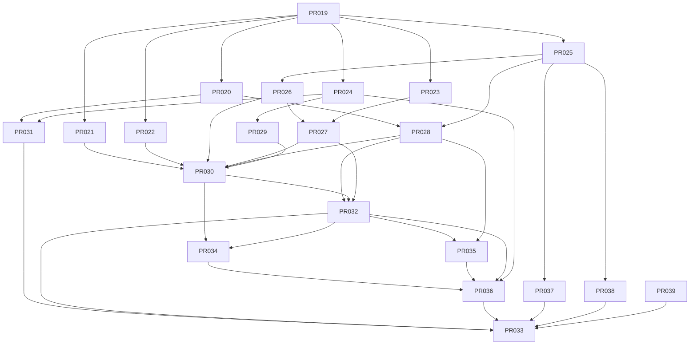

# Tasks: Source SDK + Primer Crawler (XTrace)

**Input**: `spec.md` (APPROVED), `plan.md`, `data-model.md`, `contracts/`, ADR-0009/0010/0011.

**Feature branch base**: `feature/002-source-sdk-crawler` (cada PR usa su propia rama
plana `feature/002-source-sdk-crawler-PR-0NN-slug` — mismo esquema que la fase 1 — y
termina en un PR aislado).

**Convención de estado por tarea**: `READY` cuando cumple la Definición de Ready
(AGENTS.md §11) y sus dependencias están `DONE`. Solo el orquestador cambia estos estados.

> **Nota para el orquestador (DeepSeek V4 Pro)**: asigna una tarea a la vez por
> implementador (`deepseek-v4-flash`). Respeta `allowed_paths` (dos agentes nunca editan los
> mismos archivos). Tras cada tarea: revisión por un agente **distinto** + handoff en
> `docs/handoffs/PR-0NN.md`. No merge a `main` sin aprobación humana y CI verde.
>
> **Puerta legal (SEC-002)**: el adapter real de xvideos permanece **deshabilitado** hasta
> la revisión legal/ToS/robots del humano. Ningún PR depende de ejecutar contra xvideos
> real; todo se valida con mock/fixtures sintéticos.

---

## Leyenda

- **Prioridad**: P0 (imprescindible) · P1 (MVP de la fase) · P2 (importante).
- **Complejidad**: XS / S / M / L (sin XL; si algo sale XL, dividir).
- **[P]**: paralelizable con otras `[P]` que no compartan `allowed_paths` ni dependencias.

---

## Fase 0 — Setup

### PR-019 · Bootstrap del servicio crawler + CI
- **Estado**: DONE (implementado + revisado APPROVED tras fix de mypy en CI + mergeado a la rama de fase)
- **Prioridad**: P0 · **Complejidad**: S · **Rol**: implementer · **Riesgo**: bajo
- **Spec/Req**: FR-003 (base) · ADR-0011 · plan §Project Structure
- **Objetivo**: Crear `services/crawler/` (paquete `xtrace_crawler`): `pyproject.toml` con
  dependencia editable `xtrace_spike` (`[tool.uv.sources] path = "../search-spike"`),
  `ruff`/`mypy`/`pytest`, `Dockerfile`, `config.py` base (pydantic-settings: DB), CLI Typer
  vacía con `--help`, y workflow GitHub Actions `python-crawler-quality` que no rompe la
  pipeline JS ni el job del spike.
- **Scope**: scaffolding, toolchain, CI. Sin lógica de dominio.
- **Dependencias**: — (el paquete `xtrace_spike` ya existe y está mergeado)
- **allowed_paths**: `services/crawler/**`, `.github/workflows/python-crawler-quality.yml`,
  `docs/handoffs/PR-019.md`
- **Tests**: pytest smoke (import paquete + `xtrace-crawler --help`); CI verde.
- **Done**: `ruff`, `mypy`, `pytest` pasan; `uv run xtrace-crawler --help` funciona;
  `import xtrace_spike` resuelve desde el crawler (ADR-0011).
- **Paralelizable con**: — (base de todo)

---

## Fase 1 — US1: contrato SDK + mock + fixtures (P1) 🎯

### PR-020 · [P] `SourceAdapter` (ABC) + `AdapterManifest` + entidades normalizadas
- **Estado**: DONE (implementado + revisado APPROVED + mergeado a la rama de fase, Ola A)
- **Prioridad**: P0 · **Complejidad**: S · **Rol**: implementer · **Riesgo**: bajo
- **Spec/Req**: FR-001, FR-002 · ADR-0009 · contracts §1/§2
- **Objetivo**: `adapters/base.py` (protocolo async `SourceAdapter` + `AdapterManifest` +
  `DiscoverPage`/`VideoAvailability`) y `adapters/models.py` (`VideoSource`, `VisualAsset`
  con validación pydantic estricta). El core nunca ve HTML/JSON de la web.
- **Dependencias**: PR-019
- **allowed_paths**: `services/crawler/xtrace_crawler/adapters/base.py`,
  `services/crawler/xtrace_crawler/adapters/models.py`,
  `services/crawler/tests/unit/test_adapters_base.py`, `docs/handoffs/PR-020.md`
- **Tests**: validación de `VideoSource` (URLs http(s), campos opcionales), manifest
  inmutable en su contracto (campos de compliance requeridos).
- **Done**: contrato estable y testeado; firma idéntica a `contracts/README.md` §1/§2.
- **Paralelizable con**: PR-022, PR-023, PR-024, PR-025

### PR-021 · [P] `MockAdapter` + fixtures + harness sin red
- **Estado**: DONE (implementado + revisado APPROVED + mergeado a la rama de fase, Ola B)
- **Prioridad**: P1 · **Complejidad**: M · **Rol**: implementer · **Riesgo**: bajo
- **Spec/Req**: FR-003, SC-001 · contracts §1
- **Objetivo**: `adapters/mock.py`: adapter determinista (catálogo sintético con paginación
  por cursor, metadatos, assets storyboard/thumbnail/preview simulados, fallos inyectables)
  + `tests/fixtures/` + harness (helpers de construcción de casos y de inyección de fallos).
- **Dependencias**: PR-020
- **allowed_paths**: `services/crawler/xtrace_crawler/adapters/mock.py`,
  `services/crawler/tests/fixtures/**`, `services/crawler/tests/unit/test_mock_adapter.py`,
  `docs/handoffs/PR-021.md`
- **Tests**: flujo completo offline (discover→get_video→get_visual_assets) determinista;
  fallos inyectados quedan contenidos en el adapter; paginación por cursor.
- **Done**: mock + fixtures permiten testear todo el pipeline sin red (SC-001).
- **Paralelizable con**: PR-022, PR-023, PR-024, PR-026, PR-028, PR-029 (archivos disjuntos)

### PR-022 · [P] Rate limiter por adapter (defaults + env, D5)
- **Estado**: DONE (implementado + revisado APPROVED + mergeado a la rama de fase, Ola A)
- **Prioridad**: P1 · **Complejidad**: S · **Rol**: implementer · **Riesgo**: bajo
- **Spec/Req**: FR-009, SC-005 · D5 · contracts §4
- **Objetivo**: `crawling/ratelimit.py`: limitador async por fuente (intervalo mínimo +
  ráfaga/sostenido) con jitter; defaults desde el manifest del adapter y overrides por env
  (`XTRACE_CRAWLER_RATE_<SOURCE>_MIN_INTERVAL_MS`, `..._MAX_RPS`); esperas medibles/loggeadas.
- **Dependencias**: PR-019
- **allowed_paths**: `services/crawler/xtrace_crawler/crawling/ratelimit.py`,
  `services/crawler/xtrace_crawler/config.py` (sección rate),
  `services/crawler/tests/unit/test_ratelimit.py`, `docs/handoffs/PR-022.md`
- **Tests**: no supera el límite declarado; el override por env gana al default; jitter no
  viola el intervalo mínimo.
- **Done**: rate limits configurables y medibles (SC-005 verificable).
- **Paralelizable con**: PR-020, PR-021, PR-023, PR-024, PR-025

### PR-023 · [P] Backoff exponencial + jitter
- **Estado**: DONE (implementado + revisado APPROVED + mergeado a la rama de fase, Ola A)
- **Prioridad**: P1 · **Complejidad**: XS · **Rol**: implementer · **Riesgo**: bajo
- **Spec/Req**: FR-008 · ADR-0010 · contracts §3
- **Objetivo**: `jobs/backoff.py`: `next_attempt_delay(attempt, base=1s, factor=2,
  cap=1h)` con jitter completo; distinción de errores transitorios vs terminales.
- **Dependencias**: PR-019
- **allowed_paths**: `services/crawler/xtrace_crawler/jobs/backoff.py`,
  `services/crawler/tests/unit/test_backoff.py`, `docs/handoffs/PR-023.md`
- **Tests**: crecimiento exponencial acotado por cap; jitter dentro de rango; terminales no
  reintentan.
- **Done**: política de reintentos testeada y determinista en expectativas.
- **Paralelizable con**: PR-020, PR-021, PR-022, PR-024, PR-025

### PR-024 · [P] Cliente HTTP seguro (allowlist + anti-SSRF)
- **Estado**: DONE (implementado + revisado APPROVED + mergeado a la rama de fase, Ola A)
- **Prioridad**: P1 · **Complejidad**: S · **Rol**: implementer · **Riesgo**: medio (SEC)
- **Spec/Req**: SEC-001/003 · plan §Security strategy
- **Objetivo**: `crawling/http.py`: wrapper httpx async con **allowlist de hosts por
  adapter**, solo `https` (http solo con flag dev explícito), sin redirects fuera del
  allowlist, timeout, UA declarado y descarga a directorio temporal.
- **Dependencias**: PR-019
- **allowed_paths**: `services/crawler/xtrace_crawler/crawling/http.py`,
  `services/crawler/tests/unit/test_http.py`, `docs/handoffs/PR-024.md`
- **Tests**: rechaza hosts fuera de allowlist; bloquea redirect a host no permitido;
  timeout configurable (con transporte mock).
- **Done**: superficie SSRF contenida; cliente único para todos los adapters.
- **Paralelizable con**: PR-020, PR-021, PR-022, PR-023, PR-025

---

## Fase 2 — Datos y jobs (bloqueante)

### PR-025 · [P] Migración DB: sources + jobs + videos-web + pgTAP
- **Estado**: DONE (implementado + revisado APPROVED + mergeado a la rama de fase, Ola A)
- **Prioridad**: P0 · **Complejidad**: M · **Rol**: data-specialist · **Riesgo**: medio
- **Spec/Req**: FR-006, FR-012, DATA-001/002/003 · ADR-0010 · `data-model.md`
- **Objetivo**: Migración Supabase **no destructiva**: tabla `sources` (manifest jsonb,
  `enabled` default false), tabla `jobs` (tipos/estados, `not_before`, lease, índices de
  despacho), ampliación de `videos` (columnas web + CHECK de estados ampliado +
  `UNIQUE(source_id, external_id)` parcial). RLS deny-by-default. Tests pgTAP.
- **Dependencias**: — (solo el esquema del spike, ya en `main`)
- **allowed_paths**: `supabase/migrations/*_source_sdk_crawler.sql`,
  `supabase/tests/source_sdk_crawler_schema.test.sql`, `docs/handoffs/PR-025.md`
- **Tests**: pgTAP (tablas, constraints, unicidad parcial, CHECK, índices, RLS) vía
  `pnpm test:db`; `supabase db reset` aplica sin tocar datos del spike.
- **Done**: esquema verde en local; migración reversible documentada.
- **Paralelizable con**: PR-020, PR-021, PR-022, PR-023, PR-024

### PR-026 · [P] Repositorio de jobs (SKIP LOCKED + lease)
- **Estado**: DONE (implementado + revisado APPROVED + mergeado a la rama de fase, Ola B)
- **Prioridad**: P0 · **Complejidad**: M · **Rol**: implementer · **Riesgo**: medio
- **Spec/Req**: FR-006, FR-008 · ADR-0010 · contracts §3
- **Objetivo**: `jobs/types.py` + `jobs/repo.py`: encolar (dedupe por unicidad de payload
  cuando aplique), `claim_next()` con `FOR UPDATE SKIP LOCKED` y marca `running`/lease en
  la misma transacción, `complete()`, `fail()` (backoff vía `not_before`), `unavailable()`,
  `reset_stale_leases()`.
- **Dependencias**: PR-025
- **allowed_paths**: `services/crawler/xtrace_crawler/jobs/types.py`,
  `services/crawler/xtrace_crawler/jobs/repo.py`,
  `services/crawler/tests/integration/test_jobs_repo.py`, `docs/handoffs/PR-026.md`
- **Tests**: integration contra Supabase local: claim único entre workers concurrentes;
  backoff programa `not_before`; terminales no reintentan; lease reset funciona.
- **Done**: semántica de cola cubierta contra la BD real.
- **Paralelizable con**: PR-021, PR-028, PR-029 (archivos disjuntos)

### PR-027 · Worker de jobs (aislamiento por fuente)
- **Estado**: DONE (implementado + revisado APPROVED + mergeado a la rama de fase, Ola C)
- **Prioridad**: P0 · **Complejidad**: M · **Rol**: implementer · **Riesgo**: medio
- **Spec/Req**: FR-006, FR-008, FR-010, SC-008 · ADR-0010
- **Objetivo**: `jobs/worker.py`: bucle async con concurrencia configurable; `claim →
  ejecutar handler según job_type → complete/fail`; lease reset periódico; un fallo de
  handler **no** tumba el worker ni otros jobs; handlers de DISCOVER/CHECK_AVAILABILITY.
  **Nota de la revisión PR-021**: `backoff.classify_error` recibe la excepción; los errores
  "removed" del mock se clasifican terminales solo si el worker pasa el mensaje/atributos —
  coordina `classify_error` con los errores tipados del mock (PR-021) y usa el estado
  `unavailable` para terminales (FR-008).
- **Dependencias**: PR-023, PR-026
- **allowed_paths**: `services/crawler/xtrace_crawler/jobs/worker.py`,
  `services/crawler/xtrace_crawler/jobs/backoff.py` (solo si hay que extender la lista de
  errores terminales — nota de la revisión PR-023),
  `services/crawler/tests/unit/test_worker.py`,
  `services/crawler/tests/integration/test_worker.py`, `docs/handoffs/PR-027.md`
- **Tests**: unit con repo fake (transiciones, aislamiento SC-008); integration con Supabase
  local (despacho real + crash simulado → lease reset).
- **Done**: worker fiable ante fallos de una fuente; estados terminales garantizados.
- **Paralelizable con**: — (Ola C; desbloquea PR-030)

### PR-028 · [P] Registro de adapters (gate SEC-002) + repo de fuentes/vídeos-web/stats
- **Estado**: DONE (implementado + revisado APPROVED + mergeado a la rama de fase, Ola B)
- **Prioridad**: P0 · **Complejidad**: M · **Rol**: implementer · **Riesgo**: medio (SEC)
- **Spec/Req**: FR-012, FR-013, FR-014, SEC-002 · ADR-0009 · `data-model.md`
- **Objetivo**: `adapters/registry.py` (resuelve adapters por nombre; **no habilita**
  adapters reales sin las 4 condiciones del gate — `robots_reviewed`, `terms_reviewed`,
  `review_date` presente y `enabled` en `sources`; decisión de revisión: `review_date` se
  mantiene por SEC-002) y `repo.py` (CRUD sources, upsert vídeos web por
  `(source_id, external_id)`, estados ampliados, `exclude`, `stats`).
- **Dependencias**: PR-020, PR-025
- **allowed_paths**: `services/crawler/xtrace_crawler/adapters/registry.py`,
  `services/crawler/xtrace_crawler/repo.py`,
  `services/crawler/tests/unit/test_registry.py`,
  `services/crawler/tests/integration/test_repo.py`, `docs/handoffs/PR-028.md`
- **Tests**: gate deniega adapter sin manifest revisado (SEC-002); upsert idempotente
  (SC-003); stats por estado/fuente.
- **Done**: habilitación de fuentes bloqueada por diseño; repos de la fase operativos.
- **Paralelizable con**: PR-021, PR-026, PR-029, PR-031 (archivos disjuntos)

---

## Fase 3 — US2: del asset al índice (P1) 🎯

### PR-029 · [P] Descarga y transformación de visual assets (nunca vídeo completo)
- **Estado**: DONE (implementado + revisado APPROVED + mergeado a la rama de fase, Ola B)
- **Prioridad**: P1 · **Complejidad**: M · **Rol**: implementer · **Riesgo**: medio
- **Spec/Req**: FR-005, FR-015, SC-006 · contracts §7
- **Objetivo**: `assets/fetch.py` (descarga via `http.py` a dir temporal, cleanup
  `try/finally`), `assets/storyboard.py` (crop de tiles del sprite + timestamp aproximado
  por posición), `assets/preview.py` (FFmpeg sobre previews cortos; **nunca** vídeo
  completo).
- **Dependencias**: PR-024
- **allowed_paths**: `services/crawler/xtrace_crawler/assets/**`,
  `services/crawler/tests/fixtures/assets/**`,
  `services/crawler/tests/unit/test_assets.py`, `docs/handoffs/PR-029.md`
- **Tests**: crop de sprite sintético con nº de tiles y timestamps correctos; preview
  corto → frames (marcado slow si FFmpeg no está en CI); cleanup sin temporales (FR-015).
- **Done**: frames con timestamp desde storyboard/thumbnail/preview; 0 vídeos completos.
- **Paralelizable con**: PR-021, PR-026, PR-027, PR-028, PR-031

### PR-030 · Pipeline crawler → índice (reutiliza `xtrace_spike`)
- **Estado**: DONE (implementado + revisado APPROVED + mergeado a la rama de fase, Ola D)
- **Prioridad**: P1 · **Complejidad**: M · **Rol**: implementer · **Riesgo**: medio
- **Spec/Req**: FR-007, FR-010, FR-011, SC-002/003/004 · ADR-0011 · contracts §6
- **Objetivo**: `pipeline.py`: `discover` (BACKFILL/INCREMENTAL con cursor y límite) →
  upsert vídeos → jobs FETCH_METADATA/INDEX_VIDEO/… → assets → frames → pHash + embedding
  (via `xtrace_spike`) → `VectorStore.upsert_frames` → vídeo `indexed`; idempotencia
  (SC-003) y cleanup (SC-004).
  **Alineación exigida por la revisión de la Ola A**: unificar `RateLimitSpec` — definición
  canónica ÚNICA en `adapters/base.py` (con defaults, `max_rps` con `gt=0`);
  `crawling/ratelimit.py` la importa y se borra su duplicado; el pipeline consume
  `manifest.rate_limit` (contracts §1). Ajustar imports/tipos donde haga falta (sin romper
  los tests de PR-020/022).
  **Notas de la revisión de la Ola B**: (1) declarar `pillow` explícitamente en
  `pyproject.toml` (PR-029 lo usa transitivo) y refrescar `uv.lock`; (2) `upsert_source` de
  PR-028 sobrescribe `enabled` — al actualizar manifest pásale el estado completo para no
  revocar una habilitación previa.
- **Dependencias**: PR-021, PR-022, PR-026, PR-027, PR-028, PR-029
- **allowed_paths**: `services/crawler/xtrace_crawler/pipeline.py`,
  `services/crawler/xtrace_crawler/adapters/base.py` (RateLimitSpec canónico),
  `services/crawler/xtrace_crawler/crawling/ratelimit.py` (importar, borrar duplicado),
  `services/crawler/pyproject.toml` + `services/crawler/uv.lock` (solo añadir pillow),
  `services/crawler/tests/unit/test_ratelimit.py` y
  `services/crawler/tests/unit/test_adapters_base.py` (solo si la unificación exige
  ajustarlos, sin debilitarlos),
  `services/crawler/tests/integration/test_pipeline.py`, `docs/handoffs/PR-030.md`
- **Tests**: integration end-to-end con MockAdapter contra Supabase local: vídeos+frames+
  embeddings consultables (SC-002); INCREMENTAL no duplica (SC-003); job fallido termina
  en estado final sin temporales (SC-004).
- **Done**: el índice del spike se alimenta desde una fuente (mock) por jobs.
- **Paralelizable con**: PR-031 (archivos disjuntos)

### PR-031 · [P] `XvideosAdapter` + fixtures sintéticos (deshabilitado por defecto)
- **Estado**: DONE (implementado + revisado APPROVED + mergeado a la rama de fase, Ola B)
- **Prioridad**: P1 · **Complejidad**: M · **Rol**: implementer · **Riesgo**: medio (SEC)
- **Spec/Req**: FR-004, SEC-001/002, SC-007 · ADR-0009 · plan §Risks
- **Objetivo**: `adapters/xvideos.py`: parsing HTML (selectolax) de página de vídeo y de
  páginas de listado (discover con cursor), storyboard/thumbnails, manifest de compliance
  **sin revisión legal** (`robots_reviewed=false`, `terms_reviewed=false` →
  no habilitable). Fixtures **sintéticos** con la estructura real (títulos anonimizados;
  ninguna media real en el repo — SEC-004).
- **Dependencias**: PR-020, PR-024
- **allowed_paths**: `services/crawler/xtrace_crawler/adapters/xvideos.py`,
  `services/crawler/tests/fixtures/xvideos/**`,
  `services/crawler/tests/unit/test_xvideos_adapter.py`, `docs/handoffs/PR-031.md`
- **Tests**: parseo de fixtures sintéticos (metadatos, assets, paginación); regresión de
  estructura; el gate de registry lo mantiene deshabilitado; el core no importa el adapter.
- **Done**: adapter real listo técnicamente; bloqueado por diseño hasta revisión humana.
- **Paralelizable con**: PR-028, PR-029, PR-030

---

## Fase 4 — Operación y cierre

### PR-032 · CLI completa: sources/backfill/run-worker/stats/check-availability
- **Estado**: DONE (implementado + revisado APPROVED + mergeado a la rama de fase, Ola E)
- **Prioridad**: P1 · **Complejidad**: S · **Rol**: implementer · **Riesgo**: bajo
- **Spec/Req**: FR-006, FR-007, FR-014, NFR-004 · contracts §5 · D2/D4/D5
- **Objetivo**: `cli.py` (Typer): `sources`, `backfill [--incremental] [--limit]`,
  `run-worker [--concurrency] [--once]`, `stats`, `check-availability`; salida JSON estable.
- **Dependencias**: PR-027, PR-028, PR-030
- **allowed_paths**: `services/crawler/xtrace_crawler/cli.py`,
  `services/crawler/xtrace_crawler/config.py`,
  `services/crawler/tests/unit/test_cli.py`, `docs/handoffs/PR-032.md`
- **Tests**: comandos con mock adapter (sin red): backfill encola; worker --once procesa;
  stats coherente; JSON estable.
- **Done**: operación completa del crawler desde CLI (quickstart ejecutable).
- **Paralelizable con**: PR-031

### PR-034 · Fix: assets del mock servidos in-process (flujo offline real)
- **Estado**: DONE (implementado + revisado APPROVED + mergeado a la rama de fase)
- **Prioridad**: P0 · **Complejidad**: S · **Rol**: implementer · **Riesgo**: medio
- **Spec/Req**: FR-003, FR-011, SC-001, SC-002 · ADR-0009 · contracts §1
- **Objetivo** (hallazgo de la validación real del quickstart, PR-033): con el cableado
  real del CLI/worker, `INDEX_VIDEO` del mock degrada todos los assets
  (`http://mock.local/...` pasa por el `SafeHTTPClient` real y falla) → 0 vídeos
  indexados. El mock debe servir sus assets **in-process, sin red** (FR-003, SC-001).
  Fix: método opcional `fetch_asset_bytes(url) -> bytes | None` en `SourceAdapter`
  (default `None` → descarga HTTP); `MockAdapter` lo implementa devolviendo bytes
  sintéticos deterministas (imágenes Pillow del catálogo); `pipeline.py` lo prefiere
  frente a `AssetFetcher` cuando existe. Sin cambios de contrato funcional para fuentes
  reales.
- **Dependencias**: PR-030, PR-032
- **allowed_paths**: `services/crawler/xtrace_crawler/adapters/base.py`,
  `services/crawler/xtrace_crawler/adapters/mock.py`,
  `services/crawler/xtrace_crawler/pipeline.py`,
  `services/crawler/tests/unit/test_mock_adapter.py`,
  `services/crawler/tests/integration/test_pipeline.py`,
  `docs/handoffs/PR-034.md`
- **Tests**: unit (mock devuelve bytes estables; base devuelve None); integration:
  flujo completo con el cableado REAL (worker + repos reales) → vídeos `indexed` con
  frames+embeddings consultables **sin red** (SC-002 con mock, regresión del hallazgo).
- **Done**: `backfill mock + run-worker --once` real indexa vídeos (0 fallos INDEX_VIDEO).
- **Paralelizable con**: — (cierre)

### PR-033 · Validación operativa con xvideos real + cierre de la fase
- **Estado**: BLOCKED — parte de orquestador COMPLETADA (quickstart validado con cableado
  real + docs de cierre, 2026-08-16); **pendiente la puerta legal humana** (ToS/robots de
  xvideos → habilitar → backfill acotado real, SC-002) — SEC-002. No es trabajo de código.
- **Prioridad**: P2 · **Complejidad**: S · **Rol**: orchestrator + operador · **Riesgo**: medio
- **Spec/Req**: SC-002, SC-003, SC-005, SC-006, SC-007, SC-008 · cierre spec 002
- **Objetivo**: Con el manifest de xvideos revisado por el humano (`robots_reviewed`,
  `terms_reviewed`, `rate_limit`, `review_date`), habilitar `enabled=true`, ejecutar
  **backfill acotado manual** (límite del operador, p. ej. ≤ 100 vídeos), verificar
  SC-002/003/005/006 y registrar evidencias. Actualizar `docs/STATUS.md`, validar
  `quickstart.md` y marcar la spec 002 (`IMPLEMENTING` → `IMPLEMENTED` si todo verde).
- **Dependencias**: PR-032 (+ revisión legal humana)
- **allowed_paths**: `docs/STATUS.md`, `specs/002-source-sdk-crawler/spec.md` (estado),
  `specs/002-source-sdk-crawler/quickstart.md`, `docs/handoffs/PR-033.md`
- **Tests**: gates Python + pgTAP + `pnpm verify` en verde; evidencias del backfill real.
- **Done**: índice alimentado desde xvideos de forma permitida y medida; fase cerrada.
- **Paralelizable con**: —

---

## Fase 4b — Cierre de calidad (post-analyze/converge/security-review)

### PR-035 · Observabilidad: stats con rate-limit waits + logs por etapa
- **Estado**: DONE (implementado + revisado APPROVED + mergeado a la rama de fase, Ola F1)
- **Prioridad**: P1 · **Complejidad**: S · **Rol**: implementer · **Riesgo**: bajo
- **Spec/Req**: FR-014, SC-005, NFR-004 · plan §Observability · converge F1/F2
- **Objetivo**: `stats --json` con sección `rate_limits` por fuente (requests,
  rate_limit_waits, total_wait_ms) sin romper campos existentes; logs con intento N/M,
  delay de backoff real y duración por etapa (discover/metadata/assets/embed).
- **Dependencias**: PR-028, PR-032
- **allowed_paths**: `repo.py`, `cli.py`, `pipeline.py`, `jobs/worker.py` + tests correspondientes + handoff.
- **Done**: pytest 287 verde; `stats` evidencia SC-005/NFR-004.

### PR-036 · Hardening de seguridad + cota global de backfill
- **Estado**: DONE (implementado + revisado APPROVED + mergeado a la rama de fase, Ola G)
- **Prioridad**: P0 · **Complejidad**: M · **Rol**: implementer · **Riesgo**: medio (SEC)
- **Spec/Req**: SEC-001/003, FR-007, SC-005 · security-review P1/P2 · analyze hallazgo 2
- **Objetivo**:
  (1) **SSRF**: `_client_for_assets` no derivará la allowlist de las URLs parseadas — lista
  por fuente revisada (xvideos.com + CDNs documentados); (2) **DNS rebinding**: validar la
  IP resuelta (rechazar RFC1918/link-local/metadata 169.254.169.254) + documentar en
  README/plan; (3) **decompression bomb**: límite estricto de píxeles al abrir imágenes
  (además del max_bytes); (4) **cota global `--max-videos`** en `backfill` (payload +
  pipeline la respeta; obligatoria para el backfill real de xvideos); (5) alinear el
  manifest del mock en `supabase/seed.sql` con el manifest canónico del código; (6)
  sincronizar `contracts/README.md` §5 con la sección `rate_limits` de PR-035.
- **Dependencias**: PR-024, PR-032, PR-034, PR-035, PR-038
- **allowed_paths**: `crawling/http.py`, `pipeline.py`, `assets/fetch.py`,
  `assets/storyboard.py`, `cli.py`, `config.py`, `supabase/seed.sql`,
  `specs/002-source-sdk-crawler/contracts/README.md`, tests correspondientes
  (`test_http.py`, `test_pipeline.py`, `test_cli.py`, `test_assets.py`), handoff.
- **Tests**: URL de asset con host fuera de la allowlist por fuente → rechazada (sin
  depender del parseo); IP privada/metadata rechazada; imagen con píxeles por encima del
  límite → error tipado; `--max-videos` corta el discover sin perder trazabilidad;
  regresión: mock sigue indexando offline (PR-034).
- **Done**: pytest/mypy/ruff verdes; gate xvideos intacto; quickstart mock sigue verde.

### PR-037 · CI hardening del workflow crawler
- **Estado**: DONE (implementado + revisado APPROVED + mergeado a la rama de fase, Ola F1)
- **Prioridad**: P2 · **Complejidad**: XS · **Rol**: implementer · **Riesgo**: bajo
- **Spec/Req**: NFR-001/003 · security-review P2-CI · converge F3
- **Objetivo**: actions pineadas por SHA + `permissions: contents: read` + decisión
  documentada (pgTAP/integración local, precedente del spike). Triggers/paths intactos.
- **Dependencias**: PR-019, PR-025
- **allowed_paths**: `.github/workflows/python-crawler-quality.yml`, handoff.

### PR-038 · Seed reproducible de sources
- **Estado**: DONE (implementado + revisado APPROVED + mergeado a la rama de fase, Ola F1)
- **Prioridad**: P2 · **Complejidad**: XS · **Rol**: data-specialist · **Riesgo**: bajo
- **Spec/Req**: DATA-001, SEC-002 · converge F4
- **Objetivo**: `supabase/seed.sql` con mock (enabled) y xvideos (deshabilitado) idempotente;
  quickstart actualizado (registro automático con `db reset`).
- **Dependencias**: PR-025
- **allowed_paths**: `supabase/seed.sql`, `quickstart.md`, handoff.

### PR-039 · Armonización documental post-analyze
- **Estado**: DONE (implementado + revisado APPROVED + mergeado a la rama de fase, Ola F1)
- **Prioridad**: P2 · **Complejidad**: S · **Rol**: docs · **Riesgo**: bajo
- **Spec/Req**: trazabilidad constitución §3 · analyze hallazgos 1/6/8/9
- **Objetivo**: justificación Vercel/Preview en plan.md; árbol sin `discover.py`;
  `duration_ms` en spec; `rate_limit` dentro de manifest en data-model; contracts §5
  (--limit=página, --max-videos previsto) y §4 (snapshot de enabled).
- **Dependencias**: —
- **allowed_paths**: `plan.md`, `spec.md`, `data-model.md`, `contracts/README.md`, handoff.

### PR-040 · `asset_hosts` en el contrato de adapters + README seguridad
- **Estado**: DONE (implementado + revisado APPROVED + mergeado a la rama de fase, Ola G2)
- **Prioridad**: P1 · **Complejidad**: XS · **Rol**: implementer · **Riesgo**: bajo
- **Spec/Req**: SEC-001 · follow-up de PR-036 (SSRF allowlist por fuente)
- **Objetivo**: `asset_hosts` formalizado (docstring del protocolo + atributos de clase,
  patrón `fetch_asset_bytes` PR-034): mock `[]` (in-process), xvideos lista PROVISIONAL
  marcada para validar en PR-033; README del servicio con sección Seguridad (SSRF,
  DNS rebinding, límite de píxeles, TOCTOU residual).
- **Dependencias**: PR-036
- **allowed_paths**: `adapters/base.py`, `adapters/mock.py`, `adapters/xvideos.py`,
  `services/crawler/README.md`, tests correspondientes, handoff.
- **Notas de revisión (cosméticas, diferidas al próximo PR de código)**: sincronizar
  `contracts/README.md` §1 (`frozenset|set` → `list[str]`) y la redacción obsoleta "el
  mock no declara asset_hosts" en `pipeline.py`/`contracts`.

---

## Grafo de dependencias

## Plan de paralelización (para el orquestador)

- **Ola A (tras PR-019)**: PR-020, PR-022, PR-023, PR-024, PR-025 en paralelo
  (archivos disjuntos).
- **Ola B**: PR-021 (tras PR-020) · PR-026 (tras PR-025) · PR-028 (tras PR-020/025) ·
  PR-029 (tras PR-024) · PR-031 (tras PR-020/024) — en paralelo.
- **Ola C**: PR-027 (tras PR-023/026).
- **Ola D**: PR-030 (tras PR-021/022/026/027/028/029) en paralelo con PR-031.
- **Ola E**: PR-032 (tras PR-027/028/030).
- **Ola F (cierre de calidad, post-analyze/converge/security)**: PR-035 (observabilidad),
  PR-037 (CI hardening), PR-038 (seed) y PR-039 (docs) en paralelo; PR-034 fue un fix de
  hallazgo de la validación del quickstart (entre PR-032 y PR-033).
- **Ola G**: PR-036 (hardening de seguridad + cota global) tras PR-034/035.
- **Ola H**: PR-033 — requiere además la **revisión legal humana de xvideos** y ejecución
  manual del backfill acotado.
- Un **revisor distinto** al implementador valida cada PR (constitución §5). Con PR-033
  (puerta operativa) revisa un modelo/proveedor diferente.

## Trazabilidad requisito → PR

| Req | PR |
| --- | --- |
| FR-001/002 | PR-020, PR-039 (armonización duration_ms) |
| FR-003 / SC-001 | PR-019, PR-021, PR-034 (assets mock in-process) |
| FR-004 | PR-031 |
| FR-005 / SC-006 | PR-029 |
| FR-006 | PR-025, PR-026, PR-027, PR-032 |
| FR-007 / SC-003 | PR-030, PR-032, PR-033 (validación real) |
| FR-008 / SC-004 | PR-023, PR-026, PR-027, PR-030 |
| FR-009 / SC-005 | PR-022, PR-035 (waits en stats) |
| FR-010 / SC-008 | PR-027, PR-030 |
| FR-011 / SC-002 | PR-030, PR-034, PR-033 |
| FR-012/013 | PR-025, PR-028 |
| FR-014 | PR-028, PR-032, PR-035 |
| FR-015 | PR-029, PR-030 |
| SEC-001/003 | PR-024, PR-025 (RLS/pgTAP), PR-036 (SSRF/rebinding) |
| SEC-002 | PR-028, PR-031, PR-033, PR-038 (seed deshabilitado) |
| SEC-004 | PR-031 |
| DATA-001/002/003 | PR-025, PR-038 (seed) |
| NFR-001..004 | PR-019 (CI), PR-022, PR-024, PR-027, PR-035, PR-037 |
| SC-007 | PR-031 (+ evidencia PR-033) |
