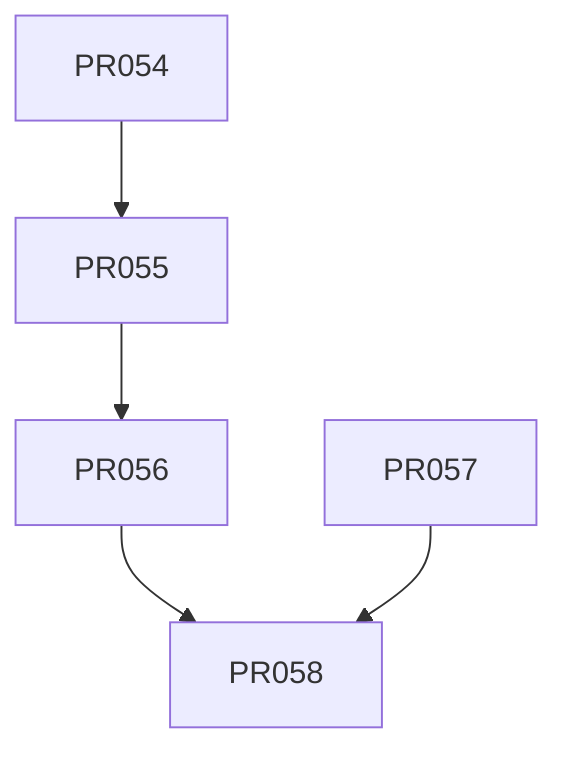

# Tasks: MVP de Búsqueda — API REST + Frontend Mínimo (XTrace)

**Input**: `spec.md` (APPROVED, 2026-08-16, decisiones D1..D5), `plan.md`,
`data-model.md`, `contracts/`, ADR-0011/0012.

**Estado**: spec 003 `APPROVED` + `plan.md` listo (technical-planning 2026-08-16).
Implementación pendiente: 5 PRs (054..058) descompuestos por task-planning. Los IDs
continúan tras PR-053 (fix del crawler, fase 2, ya mergeado a `main`).

**Feature branch base**: `feature/003-search-mvp` (cada PR usa su propia rama plana
`feature/003-search-mvp-PR-0NN-slug` y termina en un PR aislado a la rama de fase).

**Convención de estado por tarea**: `READY` cuando cumple la Definición de Ready
(AGENTS.md §11) y sus dependencias están `DONE`. Solo el orquestador cambia estos estados.

> **Nota para el orquestador (DeepSeek V4 Pro)**: asigna una tarea a la vez por
> implementador (`deepseek-v4-flash`). Respeta `allowed_paths` (dos agentes nunca editan
> los mismos archivos). Tras cada tarea: revisión por un agente **distinto** + handoff en
> `docs/handoffs/PR-0NN.md`. No merge a `main` sin aprobación humana y CI verde.
>
> **Olas**: PR-057 (frontend) puede arrancar **en paralelo** con PR-054/055: el contrato
> REST ya está fijado en `contracts/README.md` (frontera estable, FR-004) y el frontend se
> testea con `fetch` mockeado (Vitest) y stub de E2E (PR-058) — no requiere la API
> implementada. PR-055 y PR-056 comparten `main.py`/`analytics.py` → **secuenciales**.
>
> **Puerta SC-002**: la validación con captura real del corpus (Top-5 vía API) es
> **manual del operador** en local (quickstart) y puede quedar como **puerta** en el
> cierre (PR-058) sin bloquear el resto de SC (misma práctica que la puerta legal de la
> fase 2). El contenido real nunca se commitea (fixtures sintéticos).

---

## Leyenda

- **Prioridad**: P0 (imprescindible) · P1 (MVP de la fase) · P2 (importante).
- **Complejidad**: XS / S / M / L (sin XL; si algo sale XL, dividir).
- **[P]**: paralelizable con otras `[P]` que no compartan `allowed_paths` ni dependencias.

---

## Fase 0 — Bootstrap

### PR-054 · Bootstrap del servicio `services/api/` + CI
- **Estado**: READY
- **Prioridad**: P0 · **Complejidad**: S · **Rol**: implementer · **Riesgo**: bajo
- **Spec/Req**: FR-006 (base `/health`) · SEC-001/006 · NFR-001/003 · ADR-0011/0012 ·
  plan §Project Structure/§CI strategy
- **Objetivo**: Crear `services/api/` (paquete `xtrace_api`, FastAPI): `pyproject.toml`
  con dependencia editable `xtrace_spike` (`[tool.uv.sources] path = "../search-spike"`,
  ADR-0011/0012), `ruff`/`mypy`/`pytest`, `Dockerfile`, `README.md`, `config.py` base
  (pydantic-settings: `SUPABASE_DB_URL`, `XTRACE_EMBEDDING_PROVIDER`, `XTRACE_API_WORK_ROOT`
  default tempdir, bind `127.0.0.1`, CORS allowlist `XTRACE_API_CORS_ORIGINS` default
  `http://localhost:3000`) y `main.py` mínimo con **`GET /health`** (FR-006, contrato §2;
  no depende de la BD). Workflow GitHub Actions **`python-api-quality`** aditivo (mismo
  patrón que `python-crawler-quality`, incl. hardening PR-037: actions por SHA,
  `permissions: contents: read`, `uv sync --locked`, `ruff check`, `ruff format --check`,
  `mypy xtrace_api` — sin `py.typed` en el spike —, `pytest`; triggers:
  `services/api/**`, `services/search-spike/**`, el propio workflow).
- **Scope**: scaffolding, toolchain, CI, `/health`. Sin lógica de búsqueda.
- **Dependencias**: — (el paquete `xtrace_spike` ya existe y está en `main`)
- **allowed_paths**: `services/api/**`, `.github/workflows/python-api-quality.yml`,
  `docs/handoffs/PR-054.md`
- **Tests**: pytest smoke (import de `xtrace_api` + TestClient `GET /health` → 200 con el
  contrato §2); CI del nuevo workflow verde; regresión: `pnpm verify` del skeleton intacto.
- **Done**: `ruff`, `mypy xtrace_api`, `pytest` pasan en el workflow nuevo;
  `uv run uvicorn xtrace_api.main:app` responde `/health` en `127.0.0.1` (SEC-001);
  `import xtrace_spike` resuelve desde la API (ADR-0011).
- **Paralelizable con**: PR-057

---

## Fase 1 — US1: API de búsqueda por imagen (P1) 🎯

### PR-055 · `POST /search`: validación de media, borrado inmediato y contrato CLI (paridad)
- **Estado**: READY
- **Prioridad**: P1 · **Complejidad**: M · **Rol**: implementer · **Riesgo**: medio (SEC)
- **Spec/Req**: FR-001..005, FR-011 (400/413/415), FR-012 (registro), FR-013 ·
  `SEC-002/003/005` · UX-001 · NFR-002 · DATA-002/003 · SC-001/003/006 · contracts §1/§5/§7
- **Objetivo**: `routers/search.py` (**POST /search** multipart: parte `image` +
  `top_k`/`min_score` opcionales, mismos defaults que la CLI) · `media.py` (subida a
  temporal seguro `mkstemp` 0600 en `work_root`, límite por streaming a
  `MAX_QUERY_IMAGE_BYTES + 1` → **413** sin procesar; reutiliza
  `xtrace_spike.security.validate_query_image` → **415** por firma MIME y
  `open_query_image` → **400** por contenido corrupto/parte ausente/nombre vacío;
  borrado en `finally` del temporal **y** `QueryMediaContext` → **FR-003/SEC-003** incluso
  ante fallo, warning sin enmascarar) · `search_service.py` (**misma cadena que la CLI**:
  `ImageSearch` + `rank_candidates`, mismos defaults top_k=10/min_score=0.0, `asyncio.run`
  en handler sync — FR-001/005; mide `processing_ms` — NFR-002) · `schemas.py`
  (SearchResponse: paridad CLI §1 + **extensión MAY** `title`/`page_url` nullables;
  Error con `error_type`) · `deps.py` (DI store/provider/backend por petición contra el
  **índice real** — FR-013/DATA-003) · `analytics.py` (`record_search`: insert en
  `searches` sin media — FR-012: `id=search_id`, `search_type='image'`, `processing_ms`,
  `results_count`) · `config.py` (sección search) · `main.py` (registrar router +
  exception handlers 400/413/415/500 en español — UX-001). Media **nunca** persistida ni
  logueada (SEC-005).
- **Dependencias**: PR-054
- **allowed_paths**: `services/api/xtrace_api/routers/search.py`,
  `services/api/xtrace_api/media.py`, `services/api/xtrace_api/search_service.py`,
  `services/api/xtrace_api/schemas.py`, `services/api/xtrace_api/deps.py`,
  `services/api/xtrace_api/analytics.py` (solo `record_search`),
  `services/api/xtrace_api/config.py` (sección search: top_k/min_score),
  `services/api/xtrace_api/main.py`, `services/api/tests/unit/test_media.py`,
  `services/api/tests/unit/test_schemas.py`, `services/api/tests/unit/test_search_service.py`,
  `services/api/tests/integration/test_search.py`,
  `services/api/tests/integration/test_parity_cli_api.py`,
  `services/api/tests/fixtures/**`, `docs/handoffs/PR-055.md`
- **Tests**: unit `media.py` (mapeo validación→HTTP: 413/415/400 sin ejecutar búsqueda —
  SC-006), `schemas.py` (contrato §1 + extensión), `search_service.py` con
  `InMemoryVectorStore` + `FakeEmbeddingProvider` (determinista, ADR-0007). Integration
  (TestClient; Supabase local con skipif sin BD — patrón crawler): `/search` end-to-end,
  `search_id` único por búsqueda (concurrencia), fila en `searches` (FR-012), **SC-003**
  (`work_root` vacío tras éxito y tras error). **Paridad CLI-API (SC-001)**:
  `test_parity_cli_api.py` ejecuta la misma imagen por la cadena CLI (Typer CliRunner o
  las mismas funciones) y por `POST /search` sobre el **mismo índice** (in-memory en CI;
  pg local con BD) y compara `video_id`, orden y `match_score` con redondeo estable —
  ≥ 5 imágenes representativas.
- **Done**: SC-001 verde en CI; SC-003/SC-006 cubiertos por tests; contrato §1 con
  extensión `title`/`page_url` verificado.
- **Paralelizable con**: PR-057

### PR-056 · `GET /stats` + `GET /videos/{id}` + TTL de `searches` sin migración
- **Estado**: READY
- **Prioridad**: P1 · **Complejidad**: M · **Rol**: implementer · **Riesgo**: bajo
- **Spec/Req**: FR-007/008, FR-011 (404/400 `invalid_uuid`) · SEC-004/005 · DATA-001 ·
  SC-004 · contracts §3/§4/§5
- **Objetivo**: `routers/stats.py` (**GET /stats**: `videos`, `frames`, `vectors`,
  `backend` (postgres|in-memory), `embedding_provider` — mismos campos que la CLI `stats`,
  FR-007) · `routers/videos.py` (**GET /videos/{id}**: ficha con metadatos, `source`
  (join `sources`), `page_url`, `thumbnail_url`, `excluded`; **404** `video_not_found` y
  **400** `invalid_uuid` — FR-008/011) · `analytics.py` + `config.py` (**TTL configurable
  sin migración**, DATA-001: `XTRACE_API_SEARCHES_TTL_DAYS` default 30 + intervalo de
  cleanup; cleanup periódico por `created_at < now() - TTL` en el lifespan de FastAPI —
  limitación "no es expiración real" documentada en `data-model.md`/contracts §6) ·
  `main.py` (lifespan TTL + registrar routers). Acceso a BD con credenciales de servidor;
  RLS deny-by-default **intacta** (SEC-004). Analítica sin media (SEC-005).
- **Dependencias**: PR-055 (extiende `main.py` — lifespan — y `analytics.py` creados en
  PR-055; `searches` ya se inserta desde `/search`)
- **allowed_paths**: `services/api/xtrace_api/routers/stats.py`,
  `services/api/xtrace_api/routers/videos.py`, `services/api/xtrace_api/analytics.py`
  (solo cleanup TTL), `services/api/xtrace_api/config.py` (sección TTL),
  `services/api/xtrace_api/main.py` (lifespan), `services/api/tests/unit/test_analytics.py`,
  `services/api/tests/integration/test_stats.py`,
  `services/api/tests/integration/test_videos.py`, `docs/handoffs/PR-056.md`
- **Tests**: unit `analytics.py` (el cleanup borra solo filas con `created_at` vencido y
  conserva las recientes; límites de TTL/intervalo). Integration (TestClient, skipif sin
  BD): `/stats` coherente con la CLI `stats`; `/videos/{id}` 200 (ficha completa) / 400
  (UUID inválido) / 404 (inexistente); TTL ejecutado en lifespan.
- **Done**: `stats` y ficha verdes contra el índice real (validación local del operador);
  TTL documentado y testeado **sin migración** (DATA-001); `pnpm test:db` intacto.
- **Paralelizable con**: — (tras PR-055; puede solaparse con PR-057 si aún no terminó)

---

## Fase 2 — US2: Frontend mínimo (P1) 🎯

### PR-057 · [P] Frontend: página `/buscar` + cliente API (zod) + env
- **Estado**: READY
- **Prioridad**: P1 · **Complejidad**: M · **Rol**: implementer · **Riesgo**: bajo
- **Spec/Req**: FR-009/010, FR-011 (UI) · UX-001/002/003 · SEC-001 · contracts §6
- **Objetivo**: Página única **`src/app/buscar/page.tsx`** (server mínima, D2) +
  **`src/features/search/buscar-page.tsx`** (cliente: estados `idle | loading | results |
  error`, feedback de carga visible — UX-002, error en español — UX-001, cancelación de
  subida sin estados colgados) · **`src/lib/api/schemas.ts`** (zod del contrato
  SearchResponse §1 — paridad FR-004 como frontera estable; tolera
  `match_timestamp_ms: null`, `title`/`page_url` null) · **`src/lib/api/xtrace.ts`**
  (cliente `fetch` multipart con `AbortSignal.timeout(60_000)`; base por env) ·
  **`src/lib/env.ts`** (+ `NEXT_PUBLIC_XTRACE_API_URL` con **default**
  `http://127.0.0.1:8000`, sin env extra en build/CI) · `.env.example` (misma var).
  Render (UX-003): orden por score (el API ya ordena; el frontend no reordena), por
  resultado título (o `local_ref`), fuente (dominio de `page_url` o `source`), score
  `0.000`, timestamp `mm:ss` o `—` si null, enlace **"Ver original"** a `page_url` cuando
  exista o ref local **sin enlace** (edge case). Sin auth (D3). **Home y sus tests
  intactos**; sin librerías nuevas (constitución §9).
- **Dependencias**: — (el contrato REST ya está fijado en `contracts/README.md`; los tests
  usan `fetch` mockeado y el E2E stub de PR-058 — no requiere la API implementada)
- **allowed_paths**: `src/app/buscar/page.tsx`, `src/features/search/buscar-page.tsx`,
  `src/lib/api/schemas.ts`, `src/lib/api/xtrace.ts`, `src/lib/env.ts`, `.env.example`,
  `tests/unit/buscar-page.test.tsx`, `docs/handoffs/PR-057.md`
- **Tests**: Vitest + Testing Library con `fetch` mockeado: estados idle/loading/results/
  error; error en español (UX-001); resultados con score/timestamp y enlace o ref local
  (UX-003); cancelación sin estados colgados; zod valida el contrato §1 y rechaza
  desviaciones; `pnpm lint && pnpm typecheck && pnpm test && pnpm build` verdes (la home
  y sus tests siguen verdes).
- **Done**: página `/buscar` funcional contra la API local (validada de punta a punta en
  PR-058); home intacta; sin dependencias JS nuevas.
- **Paralelizable con**: PR-054, PR-055

---

## Fase 3 — E2E y cierre

### PR-058 · E2E WebdriverIO (smoke, API stubeada) + cierre de la fase
- **Estado**: READY
- **Prioridad**: P1 · **Complejidad**: S · **Rol**: QA (wdio) + orchestrator (cierre) ·
  **Riesgo**: medio (puerta SC-002)
- **Spec/Req**: SC-002/004/005 · NFR-004 · cierre spec 003 (`IMPLEMENTING` → `IMPLEMENTED`
  si SC verdes) · contracts §6
- **Objetivo**: **`tests/e2e/specs/search.smoke.e2e.ts`** (entra solo en la smoke suite
  por el patrón `*.smoke.e2e.ts` de `wdio.conf.ts` — **sin cambios** en `wdio.conf.ts` ni
  `e2e.yml`): abrir `/buscar`, subir **`tests/e2e/fixtures/query.png`** (PNG sintético
  1×1, sin contenido real), **stub del `fetch` con `browser.mock('**/search',
  { method: "POST" })`** respondiendo **`tests/e2e/fixtures/search-response.json`** (sin
  API real en CI, SC-005) y verificar: resultados visibles con título, fuente, score,
  timestamp y enlace; caso 4xx → error claro en español; feedback de carga; selectores
  estables por `data-testid` (paridad con `home.smoke.e2e.ts`). **Cierre**: validar
  `quickstart.md` de punta a punta (API real local + página + captura del corpus, SC-002 —
  **puede quedar como puerta del operador**, registrada en el handoff sin bloquear el
  resto), actualizar `docs/STATUS.md`, marcar `spec.md` → `IMPLEMENTED` si
  SC-001/003/005/006 verdes, y **reportar SC-004** (p95 de `processing_ms` medido en la
  validación local; objetivo, no garantía).
- **Dependencias**: PR-056, PR-057
- **allowed_paths**: `tests/e2e/specs/search.smoke.e2e.ts`,
  `tests/e2e/fixtures/search-response.json`, `tests/e2e/fixtures/query.png`,
  `specs/003-search-mvp/quickstart.md`, `docs/STATUS.md`,
  `specs/003-search-mvp/spec.md` (solo estado), `docs/handoffs/PR-058.md`
- **Tests**: `pnpm test:e2e:smoke` verde en CI (`e2e.yml` existente); gates Python
  (`ruff`/`mypy`/`pytest`) + `pnpm verify` verdes.
- **Done**: SC-005 verde en CI; quickstart validado de punta a punta; spec 003
  `IMPLEMENTED` (o puerta SC-002 documentada en el handoff); `STATUS.md` actualizado.
- **Paralelizable con**: — (cierre)

---

## Grafo de dependencias

## Plan de paralelización (para el orquestador)

- **Ola A**: PR-054 (bootstrap API) + **PR-057** (frontend) en paralelo — archivos
  disjuntos (`services/api/**` y `.github/workflows/python-api-quality.yml` vs
  `src/**` + `.env.example` + `tests/unit/buscar-page.test.tsx`).
- **Ola B**: PR-055 (tras PR-054) — núcleo de la fase (US1). Si al planificar la
  implementación sale XL, dividir el test de paridad (SC-001) en un PR propio.
- **Ola C**: PR-056 (tras PR-055; comparte `main.py`/`analytics.py` → secuencial, no
  paralela con PR-055).
- **Ola D**: PR-058 (tras PR-056 + PR-057) — cierre; SC-002 como **puerta manual del
  operador** en local.
- Un **revisor distinto** al implementador valida cada PR (constitución §5). Con PR-058
  (puerta operativa) revisa un modelo/proveedor diferente.

## Trazabilidad requisito → PR

| Req | PR |
| --- | --- |
| FR-001/002/003 | PR-055 |
| FR-004 | PR-055 (contrato + extensión MAY), PR-057 (zod) |
| FR-005 / SC-001 | PR-055 (paridad CLI-API) |
| FR-006 | PR-054 |
| FR-007 | PR-056 |
| FR-008 | PR-056 |
| FR-009 | PR-057 |
| FR-010 | PR-057 |
| FR-011 | PR-055 (400/413/415), PR-056 (404/400), PR-057 (UI de errores) |
| FR-012 | PR-055 (insert `searches`), PR-056 (TTL configurable) |
| FR-013 / DATA-003 | PR-055 (deps contra índice real, sin reindexar) |
| SEC-001 | PR-054 (bind 127.0.0.1/config), PR-057 (sin auth, solo local) |
| SEC-002/003 | PR-055 |
| SEC-004 | PR-055, PR-056 (service_role; RLS deny-by-default intacta) |
| SEC-005 | PR-055 (media nunca persistida/logueada), PR-056 (analítica sin media) |
| SEC-006 | PR-054 (config por env), PR-057 (`.env.example`) |
| DATA-001 | PR-056 (TTL por `created_at`, sin migración) |
| DATA-002 | PR-055 (mismo índice/ranking que la CLI) |
| NFR-001 | PR-054 (toolchain CPU local), toda la fase |
| NFR-002 | PR-055 (`processing_ms`), PR-058 (reporte SC-004) |
| NFR-003 | PR-054 (dep editable `xtrace_spike`, ADR-0011/0012) |
| NFR-004 | PR-054 (README), PR-058 (quickstart validado) |
| UX-001 | PR-055 (errores API en español), PR-057 (UI en español) |
| UX-002 | PR-057 |
| UX-003 | PR-057 |
| SC-002 | PR-058 (validación manual del operador; puerta) |
| SC-003 | PR-055 |
| SC-004 | PR-055 (medición), PR-058 (reporte p95 en handoff) |
| SC-005 | PR-058 (smoke suite, stub sin API) |
| SC-006 | PR-055 (4xx sin ejecutar búsqueda) |
